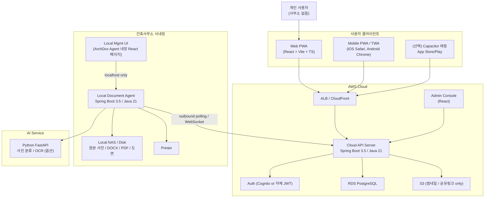

# ArchDox 상세 설계 — 전체 아키텍처

작성일: 2026-05-21
연관 문서:
- `건축자동화_개발구현계획.md` (1차 구조 결론)
- `02_상세설계_도메인및데이터.md`
- `03_상세설계_API및이벤트.md`
- `04_상세설계_이미지및스토리지.md`
- `05_상세설계_클라이언트.md`
- `06_상세설계_로컬서버_및_관리UI.md`
- `07_상세설계_멀티테넌트_admin.md`
- `08_구현순서_및_기능목록.md`

## 0. 한 문장 결론

ArchDox는 **클라우드(AWS) API + 사무소별 로컬 문서/이미지 서버 + 모바일/웹 PWA 클라이언트 + 운영 admin** 4축으로 구성하고, 멀티 사무소·개인 사용자 모두를 동일 API에 수용하는 **멀티테넌트 SaaS + 온프레미스 하이브리드** 구조로 간다.

## 1. 시스템 컨텍스트

핵심 원칙:
- **모든 사무소가 동일한 Cloud API에 접속**한다. 사무소는 `office_id`로 격리되는 멀티테넌트 단일 인스턴스. (`02_상세설계_도메인및데이터.md` §2 참조)
- **개인 사용자도 동일 API**에서 동작한다. 개인은 자동 생성된 `personal-{userId}` 가상 office에 속한다. (`07_상세설계_멀티테넌트_admin.md` §3)
- **로컬 서버는 옵션이다.** 사무소 플랜이면 ArchDox Agent를 설치하고, 개인/소규모 플랜이면 API 서버 내장 문서 생성기를 쓴다. (`06_상세설계_로컬서버_및_관리UI.md` §1)
- **Draft 입력 데이터는 Cloud 암호화 저장이 기본값**이다. 단, 보안 민감 사무소는 ArchDox Agent가 draft 정본을 보관하는 `LOCAL_ONLY` 모드를 선택할 수 있다. (`02` §3.2)
- **이미지 원본은 S3에 직접 안 올린다.** 비용 폭주 방지가 1순위 제약이다. (`04_상세설계_이미지및스토리지.md` 전체)

## 2. 아키텍처 결정 기록 (ADR 요약)

| # | 결정 | 근거 | 대안 |
|---|------|------|------|
| ADR-01 | Client는 **PWA 우선 + Capacitor 래핑**으로 iOS/Android 동시 지원 | 카메라/오프라인/푸시 PWA로 대부분 커버, 코드베이스 1개 유지 | Flutter (학습/툴체인 비용), React Native (Native bridge 유지비) |
| ADR-02 | Cloud API는 **Spring Boot 단일 모듈로 시작**, MSA 분리는 운영 단계 이후 | abyss-runner와 동일 철학, MVP 운영 비용 ↓ | 초기부터 MSA → 범위 폭증 |
| ADR-03 | ArchDox Agent도 **Spring Boot**로 통일 | Cloud API와 코드/도메인/이벤트 모델 공유 가능, Flower/Bloom 재사용 | C# WinForms (UI 좋지만 도메인 코드 이중화), .NET headless service (Java 자산 공유 못함) |
| ADR-04 | Local 관리 UI는 **ArchDox Agent에 내장된 React 페이지** (localhost binding) | 별도 앱 배포 부담 ↓, 원격 도움 시 같은 화면 공유 가능, 사내망 의존 ↓ | C# WinForms, WebForms 모두 별도 배포·업데이트 채널 추가 필요 |
| ADR-05 | 이미지 원본은 **사무소 NAS + 썸네일만 S3** 정책. 개인 플랜은 별도 S3 lifecycle (`STANDARD_IA` → `GLACIER`) | S3 비용/이그레스 폭주 방지 (`04` 문서 §3 시뮬레이션) | 전부 S3, 전부 NAS — 둘 다 한쪽 사용자군에 부적합 |
| ADR-06 | 멀티테넌시 격리는 **단일 DB + `office_id` 필터 + RLS 옵션** | 운영 단순, 사무소 추가 비용 0 | DB 분리 — 운영 비용 폭증 |
| ADR-07 | 인증은 **자체 JWT + refresh token** (초기), Cognito는 admin/SSO 확장 시 검토 | 비용/락인 회피, 멀티테넌트 claim 자유 설계 | Cognito 처음부터 — pricing tier 복잡 |
| ADR-08 | 문서 생성은 **ArchDox Agent 우선, Cloud 내장 generator는 fallback**. 둘 다 동일 Flower workflow로 작성 | 사무소 플랜 보안 + 개인 플랜 편의 동시 만족 | Cloud 전용 — 사무소가 거부, Local 전용 — 개인 못 씀 |
| ADR-09 | Draft 정본은 **Cloud 암호화 저장 기본 + Local-only 선택 모드** | PWA 오프라인/멀티기기 UX를 살리면서 보안 민감 사무소도 수용 | Cloud에 상세값 전부 평문 저장, Local-only만 지원 |
| ADR-10 | 사진 업로드는 **Cloud-mediated 기본**, ArchDox Agent 직접 업로드는 선택 옵션 | 모바일/PWA에서 사무소별 client cert mTLS 운영 난도 감소 | 모든 사무소에 직접 터널/mTLS 강제 |
| ADR-11 | 생성 문서는 **전달 요청(delivery request)** 으로만 외부 전달 | 상태 조회와 실제 파일 접근을 분리해 보안·감사를 단순화 | artifact 다운로드 API 직접 노출 |

## 3. 컴포넌트 책임 매트릭스

| 컴포넌트 | 책임 | 비책임 |
|---|---|---|
| **Cloud API** | 인증·권한·테넌시, 사무소/사용자/프로젝트/리포트 상태, 작업(job) 큐, 알림, 감사 로그, 라이선스, 썸네일/공유링크 메타 | 원본 이미지 저장, 실제 DOCX/PDF 보관, NAS 접근 |
| **ArchDox Agent** | 사진 원본 저장, NAS 연결, 템플릿 바인딩(DOCX), PDF 변환, 프린터 출력, AI 호출, heartbeat, Cloud command 폴링 | 사용자 인증, 권한, 사무소 간 데이터 노출 |
| **Local Mgmt UI** | NAS 경로 설정, 템플릿 업로드, 프린터 선택, 로그 보기, 강제 동기화 트리거 | 외부 인터넷 노출, 사용자 로그인 |
| **Client (PWA)** | 입력 wizard, 사진 촬영/업로드 UX, 오프라인 임시 저장, 진행 상태 view, 알림 수신 | 직접 파일 다운로드(원본), ArchDox Agent 관리 API 호출 |
| **Admin Console** | 사무소 등록/플랜/라이선스 관리, agent heartbeat 대시보드, 알림 발송, 감사 로그 검색 | 일반 사용자 화면 |
| **Python AI** | 사진 카테고리 top-3 추천, OCR(옵션) | 학습 자동화 (MVP 제외), 정답 라벨 결정 |

## 4. 배포 형태별 시나리오

### 4.1 사무소 플랜 (Office Tenant)
1. 사무소 가입 → Admin에서 `office_id` 발급, `archdox_agent_install_token` 발급
2. 사무소 PC/NAS에 ArchDox Agent 설치 (`win service` or `linux systemd`)
3. 토큰으로 ArchDox Agent ↔ Cloud API 페어링 (mTLS 클라이언트 인증서 발급)
4. 사용자는 모바일/웹에서 입력 → 기본값은 Cloud에 암호화 draft 저장 → 생성 요청은 ArchDox Agent에 전달
5. 보안 민감 사무소는 `LOCAL_ONLY` draft mode를 켜서 ArchDox Agent가 상세 payload 정본을 보관하고, Cloud에는 단계 메타와 해시만 남긴다.
6. 사진 업로드는 기본적으로 Cloud-mediated(S3 temp → Agent pull)로 처리한다. ArchDox Agent 직접 업로드는 터널/enrollment가 끝난 사무소만 선택하며, Client↔Agent는 짧은 만료 signed upload token을 쓴다. mTLS는 Agent↔Cloud에 적용한다.
7. Cloud는 썸네일/메타/상태/전달 이력만 보유하고, 실제 문서 파일 전달은 `12_상세설계_문서전달정책.md`를 따른다.

### 4.2 개인 플랜 (Personal Tenant)
1. 개인 가입 → 자동 `personal-{userId}` office 생성
2. ArchDox Agent 없음. Cloud 내장 generator 사용
3. 사진은 S3 (`STANDARD_IA`, 30일 후 GLACIER, 365일 후 자동 삭제 가능)
4. 무료/유료 플랜에 따라 월간 사진 용량/생성 횟수 제한

### 4.3 하이브리드
- 사무소가 출장 인력에게 개인 계정도 제공 가능
- 동일 user가 여러 사무소에 멤버십 가질 수 있도록 `office_memberships` 분리 (`02` 문서 §2.2)

## 5. 비기능 요구사항

| 카테고리 | 목표 | 측정 |
|---|---|---|
| 가용성 | Cloud API 99.5% / ArchDox Agent 24x7 best-effort | CloudWatch + heartbeat |
| 성능 | 리포트 1건 생성 < 60s (사진 30장 기준) | Flower step latency 기록 |
| 보안 | 원본 사진/도면은 인터넷 직접 노출 금지 | 분기 1회 보안 리뷰 |
| 비용 | 사용자 1명 월 데이터 비용 < 0.5 USD (개인 플랜) | `feature_usage_counters` 집계 |
| 관측 | 모든 Flow/Step/Bloom 이벤트는 trace_id로 묶임 | Micrometer + OTel |

## 6. 기술 스택 확정안

| 레이어 | 스택 |
|---|---|
| Client | React 18 + Vite + TypeScript + Tailwind + Capacitor 6 (래핑) |
| Cloud API | Java 21, Spring Boot 3.5, Spring Security, Spring Data JPA, PostgreSQL 16, Flyway, Flower + Bloom (in-house), Testcontainers, Micrometer + OTel |
| ArchDox Agent | Java 21, Spring Boot 3.5, docx4j (DOCX), LibreOffice headless (PDF), SQLite (로컬 인덱스) |
| Admin | React 18 + Vite (Cloud API와 분리 빌드, 동일 호스트 `/admin`) |
| AI | Python 3.12, FastAPI, ONNX runtime (모델은 추후) |
| Infra | AWS ALB, ECS Fargate (Cloud API), RDS PostgreSQL, S3, CloudFront, Route53, Secrets Manager |
| CI/CD | GitHub Actions + ECR + ECS deploy / ArchDox Agent는 MSI/zip 빌드 |

## 7. 핵심 비기능 제약 — "사용자가 놓치기 쉬운 것"

사용자 요청에 명시되지 않았지만 빠지면 운영이 깨지는 것들. 이 문서들에서 각각 다룸:

- **시간 동기화**: ArchDox Agent와 Cloud의 시간이 어긋나면 heartbeat가 깨진다. NTP 강제. (`06` §6)
- **오프라인 처리**: 감리 현장은 망이 약하다. 클라이언트에서 IndexedDB로 임시 저장 후 재동기화. (`05` §4)
- **사진 EXIF·해상도 정책**: 원본 그대로 저장 시 사무소 NAS도 1년만에 터진다. resize/thumbnail 정책. (`04` §4)
- **버전 호환**: Cloud API와 ArchDox Agent의 protocol version 불일치 처리. (`06` §7)
- **데이터 export/탈퇴**: 개인정보보호법 대응. 사무소 탈퇴시 데이터 export & purge job. (`07` §5)
- **백업**: Cloud는 RDS 자동 백업. ArchDox Agent는 NAS 책임이지만, 메타 SQLite는 일일 export 권고. (`06` §8)
- **로그 보존**: audit_log는 5년, 일반 app log는 90일. (`02` §4)

각 항목은 해당 sub-문서에서 더 깊게 다룬다.
