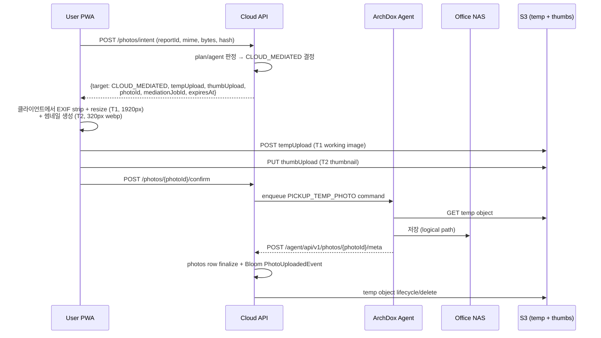
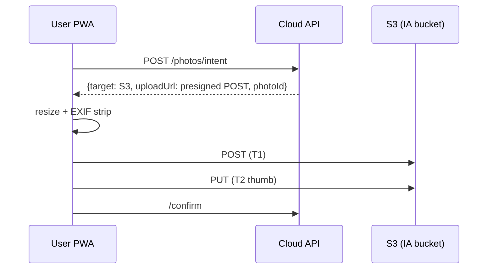

# ArchDox 상세 설계 — 이미지 & 스토리지

## 1. 사용자가 제기한 제약

> "웹 UI에서 이미지를 카메라로 찍고 감리·점검하면서 체크/특이사항 적어 저장 → 이미지를 그냥 AWS에 다 보내면 과금 감당 불가. 이미지 id나 경로만 저장하고 이미지는 별도로 저장하는 방안."

이 제약을 1순위로 둔다.

## 2. 비용 시뮬레이션 (왜 S3-only가 위험한가)

가정: 사무소 1곳, 감리원 5명, 1인당 일평균 사진 60장(원본 평균 4MB, JPEG), 월 22일 근무.

- 월 신규 사진 = 5 × 60 × 22 ≈ 6,600장
- 월 신규 용량 ≈ 6,600 × 4MB = **26.4 GB / 사무소**
- 1년 누적 ≈ 316 GB / 사무소

S3 STANDARD 단가 (서울, 2025 기준 대략):
- 저장 $0.025/GB → 1년차 누적 비용 월 ≈ 316 × $0.025 = $7.9
- 보기·다운로드 트래픽이 더 문제. 직원 5명이 매일 어제 사진 일부 재조회만 해도 월 50~100GB egress = $50~$100
- 사무소 100곳이면 **월 egress만 $5,000~$10,000**

→ S3-only 비현실적. 정책 필요.

## 3. 핵심 결정

### 3.1 계층화 저장 (Tiered)

| Tier | 무엇 | 어디 | 누가 접근 |
|---|---|---|---|
| T0 | 사용자 폰의 임시 원본 (촬영 직후) | 디바이스 | 본인 |
| T1 | resize된 작업본 (long-edge 1920px, 평균 400KB) | 사무소 NAS (사무소 플랜) / S3 IA (개인 플랜) | 사무소 멤버 |
| T2 | 썸네일 (long-edge 320px webp, 평균 20KB) | **항상 S3 STANDARD + CloudFront** | 인증된 모두 |
| T3 | 원본 (long-edge 4000px+) | NAS only (사무소) / S3 GLACIER (개인 유료) / 폐기 (개인 무료) | 본인/관리자 |

요지:
- 평소 화면에서 보는 건 **T2 썸네일**. 이건 작아서 S3+CloudFront로도 비용 적음. (월 20KB × 6,600 × 100사무소 = ~13GB egress = 푼돈)
- 클릭해서 펼치면 T1 작업본을 가져옴. 사무소 플랜이면 사내 NAS에서, 개인이면 presigned S3 URL로.
- T3 원본은 거의 안 본다. 법적 보관 의무가 있는 자료만 NAS/Glacier에 둔다.

### 3.2 사무소 플랜 vs 개인 플랜 분기

```text
Plan          | T1 위치      | T3 보관     | 월간 사진 용량 한도
--------------+--------------+-------------+--------------------
PERSONAL_FREE | S3 IA        | 폐기        | 500MB
PERSONAL_PRO  | S3 IA        | S3 GLACIER  | 10GB
OFFICE_STD    | Local NAS    | NAS         | 사무소 NAS 용량
OFFICE_ENT    | Local NAS    | NAS+백업    | 사무소 NAS 용량
```

## 4. 이미지 파이프라인

### 4.1 촬영 → 업로드 순서 (사무소 플랜 기본: Cloud-mediated)



핵심 디자인 포인트:
- **클라이언트가 resize 및 EXIF strip을 수행**. 폰 CPU로 충분. 4MB 원본을 그대로 NAS에 보내지 않음으로써 NAS 부담↓
- **원본이 필요한 경우만** 별도 토글 "원본 보관"을 켜면 T3 업로드 path가 추가됨
- **T2 썸네일은 항상 S3로 가는 별도 PUT**. NAS 다운/사내망 외부 사용자가 썸네일은 즉시 본다.
- 기본 경로는 Cloud-mediated다. 모바일/PWA에서 사무소별 mTLS client certificate를 배포하지 않아도 되고, NAT/방화벽 문제도 줄어든다.
- temp bucket은 1시간 lifecycle 삭제를 강제하고, Agent 저장 완료 시 즉시 purge한다.

### 4.2 ArchDox Agent 직접 업로드 옵션

직접 업로드는 성능 최적화 옵션이다. 다음 조건을 모두 만족하는 사무소만 켠다.

- Cloudflare Tunnel / Tailscale Funnel / WireGuard 등으로 `agent-{officeCode}.archdox.app` endpoint가 준비됨
- ArchDox Agent가 Cloud와 mTLS로 페어링되어 있음
- Cloud가 특정 `photo_id`, 파일 종류, byte range, 만료시각에 묶인 **signed upload token**을 발급
- Client는 그 token으로만 ArchDox Agent upload endpoint에 PUT. 브라우저/PWA에 client certificate를 설치하지 않는다.

사무소 자체 DDNS + 포트포워딩은 보안 위험이 커서 권장하지 않는다.

MVP는 **Cloud-mediated 기본 + 직접 업로드 선택적 enrollment**로 간다.

### 4.3 개인 플랜 업로드



S3 IA bucket lifecycle:
- 0~90일: STANDARD_IA
- 90~365일: GLACIER_IR (개인 PRO만 유지, FREE는 90일 후 자동 삭제)
- 365일+: GLACIER DEEP / 또는 삭제

## 5. `/photos/intent` 응답 규격

```json
POST /api/v1/photos/intent
{
  "reportId": 123,
  "checklistItemId": 77,
  "mime": "image/jpeg",
  "bytes": 380000,
  "hash": "sha256:...",       // 클라이언트가 resize 후 계산
  "wantsOriginal": false
}

// Case 1: 사무소 플랜 기본 (Cloud-mediated)
{
  "photoId": 9881,
  "target": "CLOUD_MEDIATED",
  "uploads": [
    {"kind": "WORKING", "method": "POST", "url": "https://s3-temp/...", "fields": {...}},
    {"kind": "THUMBNAIL", "method": "PUT", "url": "https://s3.../thumb-..."}
  ],
  "mediationJobId": 5512
}

// Case 2: 사무소 플랜 + Agent direct enrollment 완료
{
  "photoId": 9881,
  "target": "ARCHDOX_AGENT_DIRECT",
  "uploads": [
    {"kind": "WORKING", "method": "PUT", "url": "https://agent-{code}.archdox.app/upload/...", "token": "upload-token", "expiresAt": "..."},
    {"kind": "THUMBNAIL", "method": "PUT", "url": "https://s3.../thumb-..?...", "expiresAt": "..."}
  ]
}

// Case 3: 개인 플랜
{
  "photoId": 9881,
  "target": "S3",
  "uploads": [
    {"kind": "WORKING", "method": "POST", "url": "https://s3-ia/...", "fields": {...}},
    {"kind": "THUMBNAIL", "method": "PUT", "url": "https://s3.../thumb-..."}
  ]
}
```

클라이언트는 `uploads`를 순차/병렬로 처리. 둘 다 끝나면 `/confirm` 호출.

## 6. 썸네일 조회

```http
GET /api/v1/photos/{photoId}/thumbnail-url
→ {url: "https://cdn.archdox.app/t/...?sig=...", expiresAt: "..."}
```

CloudFront signed URL. 만료 5분. 클라이언트가 캐싱 (PWA service worker).

원본/작업본 조회는 별도 권한 확인 + 만료 30초의 presigned. 다운로드는 plan에 따라 제한.

## 7. 중복 사진 처리

`hash_sha256` 인덱스로 동일 사진 중복 업로드 방지:
- intent에서 hash 보고 → 이미 existing photo면 그 id를 재사용, 업로드 skip
- 같은 office 내에서만 dedup (사무소 간 데이터 leakage 방지)

## 8. 도면(CAD) / 설계도 처리

- DWG/DXF는 사무소 NAS에만. Cloud에는 메타 + small PNG preview만.
- HWP/HWPX (관공서 양식)은 MVP 제외 (`건축자동화_개발구현계획.md` §3.6).

## 9. 비용 통제 정책

- S3 PutObject/GetObject 호출 수를 office별로 일 단위 합산 → `feature_usage_counters`에 기록
- 일/월 한도 초과 시 신규 업로드 `429 + LICENSE_USAGE_EXCEEDED`
- CloudFront 비용은 월간 모니터링 알람 (개인 플랜은 thumb 도메인 caching 강제)

## 10. 보존 & 삭제

- 리포트 cancel/delete → 연결 사진을 즉시 NAS/S3에서 삭제하진 않음. soft delete 30일 grace 후 hard delete.
- 사무소 탈퇴 → export job 후 90일 grace, 그다음 purge job (Cloud meta + S3 + ArchDox Agent purge command).
- 개인정보 포함 가능성 → 사진 EXIF GPS는 사용자 동의 받은 office만 보관 (개인 플랜 기본 strip).

## 11. 보안 체크리스트

- presigned URL 만료 ≤ 15분
- ArchDox Agent 직접 업로드 token 만료 ≤ 5분, `photo_id`/MIME/bytes/hash/office에 바인딩
- 브라우저/PWA에 사무소별 mTLS client certificate를 배포하지 않음. mTLS는 Agent↔Cloud에만 적용
- 업로드 시 mime sniff + image decode 가능 여부 검증 (`Apache Tika` + `ImageIO.read`)
- `../` path 탈출 방지: ArchDox Agent의 logical key는 `[a-zA-Z0-9\-_/]{1,200}` regex 강제
- T1/T3 storage_ref는 logical key only (절대 path는 ArchDox Agent 설정으로만 해석)
- S3 bucket public access **차단**, CloudFront OAC만 허용
- thumbnail용 bucket과 working용 bucket을 **분리** (정책 관리 단순화)
