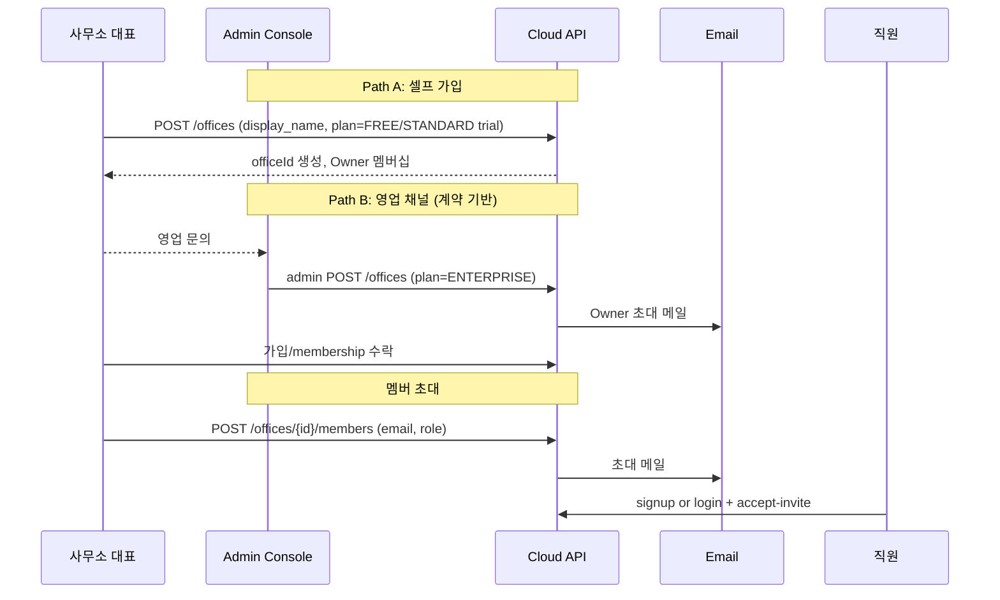

# ArchDox 상세 설계 — 멀티테넌트 & Admin

## 1. 사용자 요구

- 모든 사무소가 동일 API에 붙는다 (단일 SaaS instance)
- Admin에서 사무소 전체를 관리
- 사무소 여러 곳 + 개인 사용자 모두 수용
- 향후 확장에 열린 설계

## 2. 테넌시 구조

```
[Platform Layer]
  - users (글로벌 계정)
  - offices (= 테넌트)
  - office_memberships (N:M)
  - feature_codes (기능 카탈로그)
  - plans (요금제 카탈로그)

[Tenant Layer] (office_id로 격리)
  - projects, inspection_reports, photos, document_jobs,
    document_artifacts, templates(office_id NULL=글로벌), archdox_agents,
    feature_entitlements, feature_usage_counters, notification_events,
    audit_logs
```

테넌트 격리 3중 방어:
1. **JPA 필터**: 모든 entity는 `@FilterDef("officeFilter")` + `@Filter(condition="office_id = :officeId")`
2. **Repository wrapper**: `OfficeScopedRepository<T>`가 `officeId`를 강제 주입
3. **PostgreSQL RLS** (운영 단계): `CREATE POLICY tenant_isolation ON ... USING (office_id = current_setting('app.current_office_id')::bigint)`

세 층 모두 한 번에 켜면 디버깅이 어려우니 1+2 먼저, 3은 보안 감사 이후.

## 3. 개인 사용자 처리

- 가입 직후 자동으로 `office_type=PERSONAL`인 사무소를 생성. `office_code = personal-{userId}`
- 해당 user가 그 office의 `OWNER` membership
- UX 상 개인 사용자는 사무소 개념을 의식하지 않음 (사무소 선택 화면 skip, `X-Office-Id` 자동 설정)
- 개인이 나중에 사무소를 만들거나 가입하면 → 사무소 선택 화면 노출 시작
- 개인 사무소는 plan=PERSONAL_*, ArchDox Agent 미사용

## 4. 사무소 가입 흐름



## 5. 데이터 export / 탈퇴 / 삭제

법령(개보법, GDPR 인접) 대응:

- **개인 사용자 탈퇴**: 즉시 deactivate → 30일 유예 → 익명화(이메일 hash, PII null) + 사진 hard delete (S3 lifecycle 강제 trigger)
- **사무소 해지**:
  1. Owner가 해지 신청 → `OFFICE_TERMINATION_REQUESTED`
  2. 14일 유예 (멤버들에게 알림)
  3. Export job: 전 리포트 PDF + 메타 JSON zip → 다운로드 링크 7일
  4. 90일 cold storage
  5. Hard delete (Cloud + S3 + ArchDox Agent에 `PURGE_OFFICE` 명령)

Admin이 강제 종료 시에도 동일 path를 따른다 (단 유예 기간은 정책).

## 6. Admin Console

### 6.1 별도 SPA + 별도 인증

- 사용자 앱과 다른 도메인 권장: `admin.archdox.app`
- 자체 admin 계정 테이블 (`admin_users`) — 일반 `users`와 분리. 이중 인증(TOTP) 강제.
- 모든 admin 액션은 `audit_logs` (actor_admin_user_id 컬럼 추가) + 부재 시 슬랙/이메일 alert

### 6.2 주요 화면

1. **테넌트 관리**
   - 사무소 목록 (검색/필터: plan, status, region, 사용량)
   - 사무소 상세: 멤버, agent 상태, 사용량, 라이선스, 결제 (Stripe 연동은 운영 phase)
   - 사무소 생성 / 플랜 변경 / suspend / resume / terminate
2. **에이전트 모니터링**
   - heartbeat 대시보드 (online/degraded/offline 비율)
   - agent 상세: 최근 heartbeat 그래프, 진행 job, 버전, 디스크
   - 명령 강제 발행 (RELOAD_TEMPLATE, UPDATE_VERSION 등 allowlist)
3. **사용량 / 라이선스**
   - 기능별 월 사용량 차트
   - 한도 초과 알림 정책
   - feature_entitlements bulk 편집
4. **공지 / 알림**
   - 전체 사무소 broadcast
   - 점검 공지 (다음 주 일 03:00 점검 등)
5. **감사 / 보안**
   - audit_logs 검색 (actor, action, target)
   - 의심 활동 탐지 룰 (IP 급변, 대량 다운로드 등) — 운영 phase
6. **콘텐츠 관리**
   - 기본 템플릿 (DOCX, schema) 업로드/버전 관리
   - 체크리스트 카탈로그 (시스템 기본)
   - 법령 카탈로그 seed/갱신 이력 관리
   - template ↔ regulationRefs 매핑 검증
7. **AI 운영** (도입 후)
   - 모델 버전, 분류 정확도 모니터링
   - 라벨 피드백 데이터셋 export
8. **문서 전달 이력**
   - `document_delivery_requests` 검색
   - 외부 이메일/임시 링크 발송 감사
   - 실패한 전달 요청 재시도 또는 취소

### 6.3 권한 모델

```text
admin_role:
  PLATFORM_OWNER    # 전부 가능
  PLATFORM_ADMIN    # suspend/terminate 제외 전부
  SUPPORT           # read + 사무소별 알림 보내기 + agent 명령 일부
  BILLING           # plan/payment read & 변경
  AUDITOR           # read-only + audit log export
```

## 7. 멀티 인스턴스 / 다중 API 서버

MVP: ECS Fargate 1 task. 트래픽 늘면:
- Cloud API 수평 확장 (Sticky 없음, JWT stateless)
- Flower Worker는 **하나의 task에서만 도는 정책**으로 시작 (workers는 단일 lease)
  - leader election (Redis lock 또는 DB row lock) 도입 시 다중 task 가능
- `archdox_agent_commands` long-poll은 어느 task가 받아도 OK (DB row lock으로 명령 1회 배달 보장)

운영 phase 8에서 Redis 도입 → distributed lock + SSE pub/sub backbone.

## 8. 결제 / 청구 (참고)

MVP는 결제 미포함. 운영 단계에서:
- Stripe 또는 토스 페이먼츠
- plan 변경/취소/환불 webhook → `offices.plan_code` + `feature_entitlements` 갱신
- 한국 사업자등록증 검증/세금계산서: 토스/이지페이 같은 한국 PG 필요

## 9. SSO / 기업 인증 (장기)

대형 사무소 또는 그룹사 수요 시:
- SAML 2.0 / OIDC
- Azure AD / Google Workspace
- 사무소별 IdP mapping 테이블 추가

## 10. 사무소 격리 검증 자동 테스트

이 부분 빠지면 위험.
- Testcontainers로 DB 띄우고
- office A 사용자 토큰으로 office B 리소스 ID에 모든 API 접근 시도 → 모두 404/403
- bulk 테스트 (모든 컨트롤러 자동 enumerate) 도입 권장

## 11. 요약

- 단일 DB · 단일 인스턴스 SaaS, `office_id` 격리 3중 방어
- 개인 사용자는 가상 `personal-*` office로 동일 모델 수용
- Admin은 별도 SPA + 별도 인증 + 강한 audit
- 다중 인스턴스/Redis/SSO 등은 phase 7+에서 점진 도입
