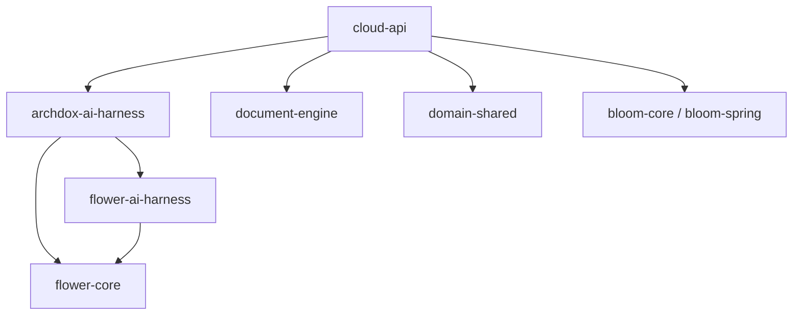

# AI Harness Architecture

## 목표

AI Harness는 ArchDox의 문서 workflow를 보조하는 검토/진단/초안 생성
레이어다.

좋은 구조의 기준:

- 문서 생성 엔진과 AI를 섞지 않는다.
- cloud-api 컨트롤러가 AI 절차를 직접 들고 있지 않는다.
- Flower가 절차, retry, timeout, refine loop를 담당한다.
- Bloom은 내부 이벤트 전달에 사용한다.
- AI provider는 교체 가능해야 한다.
- 출력 스키마는 고정되어야 한다.
- 법률검토는 반드시 근거 데이터에 기반한다.

## 추천 모듈 구조

```text
flower-ai-harness/
archdox-ai-harness/

cloud-api/
document-engine/
domain-shared/
archdox-agent/
```

`flower-ai-harness`는 범용 AI 실행 프레임워크다. ArchDox repo에서는 이
라이브러리를 가져와 사용하고, ArchDox 업무 지식은 `archdox-ai-harness`
모듈에 둔다.

초기에는 `archdox-ai-harness`만 ArchDox 전용 모듈로 유지한다.
`ai-provider-openai`, `ai-provider-ollama`, `harness-observer` 같은 범용
모듈은 지금 만들지 않는다. ArchDox 안에서 충분히 검증된 뒤 제품 중립
요소만 `flower-ai-harness-*` 계열로 추출한다.

## 의존성 방향



금지 방향:

```text
document-engine -> flower-ai-harness     금지
document-engine -> archdox-ai-harness    금지
flower-ai-harness -> cloud-api           금지
flower-ai-harness -> OpenAI SDK 직접결합 금지
archdox-ai-harness -> cloud-api          금지
```

## flower-ai-harness

범용 AI Harness 실행 모델을 담는다.

포함 가능:

- `AiHarnessRun`
- `AiHarnessStatus`
- `AiHarnessType`
- `AiHarnessStepLog`
- `AiFinding`
- `AiFindingSeverity`
- `AiFindingEvidence`
- `AiPromptContext`
- `AiModelRequest`
- `AiModelResponse`
- `AiModelGateway`
- `AiOutputSchemaValidator`
- `AiRefinePolicy`

포함 금지:

- 감리일지, 해체공사, 안전점검 같은 문서 도메인 용어
- OpenAI/Ollama/Gemini 같은 특정 provider 구현
- JPA repository
- HTTP controller
- cloud-api application service

`flower-ai-harness`는 너무 범용적인 "AI agent framework"가 되면 안 된다.
ArchDox에서 필요한 수준의 run, prompt, response, finding, retry/refine
개념만 제공한다.

## archdox-ai-harness

ArchDox 업무 전용 하네스를 담는다.

포함 가능:

- `DocumentQaHarnessFactory`
- `ReportPreflightHarnessFactory`
- `OpsDiagnosisHarnessFactory`
- `LegalReviewHarnessFactory`
- `TemplateOnboardingHarnessFactory`
- `ReportAssistHarnessFactory`
- `DocumentHarnessContext`
- `DocumentQaPromptBuilder`
- `LegalReviewPromptBuilder`
- `DocumentFindingCode`
- `DocumentFindingNormalizer`
- `DocumentHarnessDeterministicChecks`

문서 도메인 지식은 여기 들어간다.

- report snapshot
- template config
- output layout
- generated HTML text
- document job
- checklist answers
- photo assets
- legal/business rule set

운영 도메인 AI 지식도 ArchDox 전용이면 여기 들어간다.

- platform ops diagnosis prompt/schema
- 운영 finding code/category
- redacted ops snapshot 해석 규칙
- AI 비용/사용량 진단 규칙

단, 이 모듈은 ArchDox 비즈니스 상태를 직접 변경하지 않는다. DB 저장,
권한 검사, run 상태 전이, operation event 기록은 `cloud-api`가 담당한다.

## cloud-api의 역할

초기 실행 구조에서는 cloud-api 안에서 하네스 flow가 돈다.

cloud-api가 담당:

- REST 요청 수신
- 인증/권한/officeId 검사
- DB repository 구현체 제공
- Spring AI 기반 `AiModelGateway` bean 사용
- Flower worker 등록
- operation event 기록
- harness result 조회 API 제공

cloud-api가 하면 안 되는 일:

- prompt 본문을 컨트롤러에 직접 작성
- AI response JSON을 컨트롤러에서 파싱
- retry/refine loop를 서비스 메서드에서 직접 구현
- 문서 결과 품질 판단을 document-engine에 넣기

## AI Provider 추상화

ArchDox cloud-api는 OpenAI/Ollama provider 구현체를 직접 소유하지 않는다.

```text
archdox-ai-harness
-> AiModelGateway
-> flower-ai-harness-spring-ai
-> Spring AI ChatClient
-> OpenAI / Ollama
```

`flower-ai-harness-spring-ai`는 Spring AI를 대체하는 모듈이 아니다. Spring
AI `ChatClient`를 하네스의 `AiModelGateway` 계약으로 변환하는 adapter다.
`flower-ai-harness-spring-boot-starter`는 Spring Boot에서 이 adapter와
executor를 자동 bean으로 등록하는 편의 모듈이다.

Cloud API가 소유하는 것은 document AI review 요청, run/finding 저장,
operation event, REST API다. Provider client, API 호출 방식, OpenAI/Ollama
설정은 Spring AI 또는 향후 별도 harness provider module의 책임이다.

나중에는 provider 모듈을 분리할 수 있다.

```text
ai-provider-openai
ai-provider-ollama
ai-provider-gemini
ai-provider-anthropic
```

provider가 바뀌어도 하네스 결과는 같은 schema여야 한다.

## 프로세스 구조

초기:

```text
cloud-api 프로세스
  - REST API
  - Flower runtime
  - DocumentGenerationFlow
  - DocumentQaHarnessFlow
  - ReportPreflightReviewFlow
  - OpsDiagnosisFlow
  - LegalReviewHarnessFlow
```

미래:

```text
cloud-api
  - 요청 수신
  - harness job 생성
  - 상태 조회

ai-harness-worker
  - Flower runtime
  - AI 호출
  - finding 저장
```

처음부터 별도 프로세스로 빼지 않는다. 구현/운영 복잡도가 너무 빨리
증가한다. 대신 모듈 경계를 먼저 분리해서 나중에 프로세스를 분리할 수
있게 만든다.

## 범용화 후보

지금은 `archdox-ai-harness`가 ArchDox 전용이다. 나중에 다음 요소가
여러 프로젝트에서 반복되면 그때 범용 모듈로 빼는 것을 검토한다.

- harness run trace/observer
- cost/usage snapshot exporter
- provider health dashboard adapter
- Langfuse/OpenTelemetry 같은 외부 관측 도구 연동
- 공통 fake provider/test fixture

이 기준은 중요하다. 처음부터 범용 observer나 AI 운영 플랫폼을 만들면
ArchDox의 문서 workflow 개발 속도가 떨어진다. 먼저 ArchDox에서 실제로
필요한 기능을 작게 구현하고, 중복이 명확할 때만 추출한다.

## ArchDox Observer Foundation

하네스 observer는 `archdox-ai-harness`에 넣지 않는다. observer는 DB,
Platform Admin 권한, 운영 API, 비용 로그, operation event와 강하게
결합되기 때문이다.

초기 구현 위치:

```text
cloud-api
  - ai_harness_trace_events
  - ArchDoxAiHarnessTraceListener
  - Platform Admin trace 조회 API
  - Admin AI 화면의 하네스 관측 패널
```

`archdox-ai-harness`는 계속 prompt/schema/finding extractor만 담당한다.
`cloud-api`는 `TraceListener`를 주입해서 실행 이벤트를 기록한다.

현재 기록 대상:

- run started/completed/failed/cancelled
- model request submitted
- model response received
- model call failed
- schema validation completed
- refine triggered

보안 기준:

- 프롬프트 본문과 응답 원문은 observer 테이블에 저장하지 않는다.
- provider/model/callId/token/latency/status/finding count 같은 운영
  메타데이터만 저장한다.
- 운영 조회 API는 Platform Admin 전용이다.

나중에 trace exporter, Langfuse/OpenTelemetry adapter, 범용 observer가
필요해지면 이 구현 경험을 기준으로 `flower-ai-harness-observability`
같은 별도 모듈로 추출한다.

## 설계 원칙

1. AI Harness는 문서 생성 엔진의 일부가 아니다.
2. document-engine은 deterministic rendering만 담당한다.
3. AI Harness는 검토/진단/초안/보조를 담당한다.
4. Flower는 절차와 retry/refine loop를 담당한다.
5. Bloom은 내부 이벤트 전달을 담당한다.
6. AI output은 반드시 schema validation을 통과해야 한다.
7. 법률검토 finding에는 근거가 있어야 한다.
8. AI가 업무 데이터를 자동 수정하지 않는다.
9. 사람 승인 전까지 AI 결과는 suggestion/finding이다.
10. 첫 구현은 작게 시작하고 실제 반복 패턴이 생기면 확장한다.
