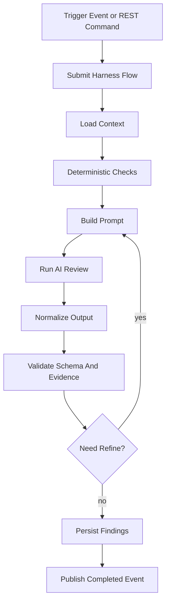

# Flower And Bloom Runtime

## Harness = Flower Flow

AI Harness는 Flower flow로 표현한다.

```text
Harness = AI를 통제된 workflow 안에서 실행하는 Flower flow
Step    = AI 또는 시스템이 수행하는 개별 절차
Finding = 사람이 확인할 수 있는 검토 결과
```

AI를 직접 호출하는 서비스 메서드를 길게 만들지 않는다. AI 작업은 느리고,
실패할 수 있고, 결과 품질 검증이 필요하므로 Flower flow가 더 적합하다.

## 기본 실행 흐름



## 기술적 retry와 품질 refine의 차이

두 개념을 섞지 않는다.

### Retry

기술 실패에 사용한다.

- AI provider timeout
- 네트워크 오류
- 5xx 응답
- JSON 파싱 실패
- 일시적 rate limit

Flower step의 retry/backoff 정책으로 처리한다.

### Refine Loop

AI 결과 품질이 부족할 때 사용한다.

- finding schema 누락
- 근거 없는 법률 주장
- 시스템 deterministic check가 잡은 문제를 AI가 누락
- 너무 일반적인 답변
- 내부 변수명 노출 같은 명백한 문제 미탐지

이 경우 같은 prompt를 단순 반복하지 않는다. critique context를 추가한
새 prompt로 재검토한다.

```text
AI review
-> schema/evidence validation
-> critique prompt build
-> AI review again
-> max 2~3 refine attempts
```

## Step 설계 예시

`DocumentQaHarnessFlow`

```text
flowType: document-qa-harness
flowKey: document-job:{documentJobId}

steps:
1. load-document-context
2. run-deterministic-document-checks
3. build-document-qa-prompt
4. execute-ai-review
5. normalize-ai-findings
6. validate-ai-findings
7. refine-if-needed
8. persist-document-findings
9. publish-document-qa-completed
```

`execute-ai-review` step은 긴 HTTP 호출을 worker tick 안에서 직접 오래
붙잡지 않는다. 필요하면 executor에 작업을 넘기고 stepNo로 관찰한다.

```text
stepNo 0  submit async AI call
stepNo 10 wait result
stepNo 20 backoff before retry
stepNo 30 refine prompt submit
```

## Bloom 사용

Bloom은 내부 이벤트 전달에 사용한다.

적절한 이벤트:

- `DocumentGeneratedEvent`
- `DocumentQaRequested`
- `DocumentQaCompleted`
- `DocumentQaFailed`
- `LegalReviewRequested`
- `LegalReviewCompleted`
- `AiHarnessFindingCreated`

Bloom은 public API contract가 아니다. UI는 Bloom을 보지 않고 DB에 저장된
run/finding 상태를 조회한다.

## Trigger 정책

자동 실행:

- 문서 생성 완료 후 `DocumentQaHarnessFlow`
- report submit 전 deterministic validation

수동 실행:

- 사용자가 "법률검토 실행" 버튼 클릭
- 관리자가 template onboarding 실행
- 운영자가 특정 document job 재검토 실행

## Recovery 정책

초기에는 Flower-native persistence에 의존하지 않는다. 복구 기준은 durable
DB state다.

예:

```text
ai_harness_runs.status in (REQUESTED, RUNNING, WAITING_RETRY)
and updated_at older than threshold
-> cloud-api startup recovery submits a fresh flow
```

같은 run을 다시 처리해도 finding 저장은 idempotent 해야 한다.

## Operation Event

중요한 상태 변화는 operation event로 남긴다.

- `AI_HARNESS_REQUESTED`
- `AI_HARNESS_STARTED`
- `AI_HARNESS_RETRYING`
- `AI_HARNESS_REFINE_REQUESTED`
- `AI_HARNESS_COMPLETED`
- `AI_HARNESS_FAILED`
- `AI_HARNESS_BLOCKED_BY_POLICY`

운영자가 admin에서 AI 하네스 비용, 실패, stuck 상태를 볼 수 있어야 한다.

