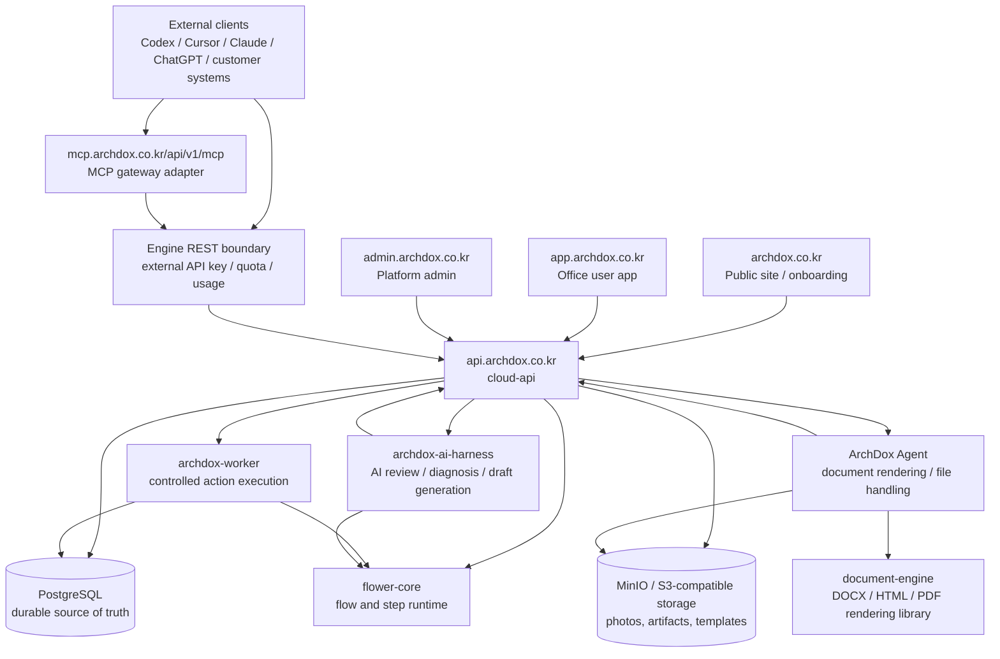
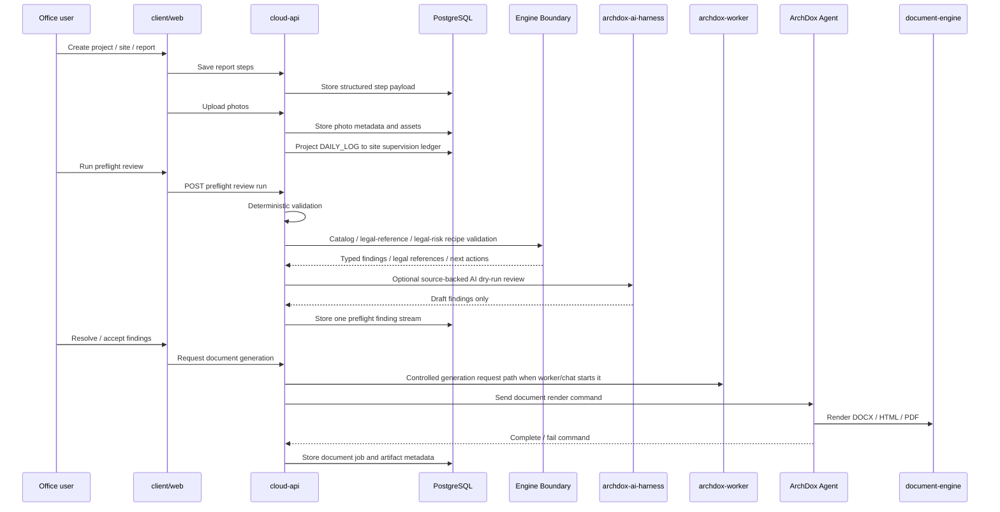
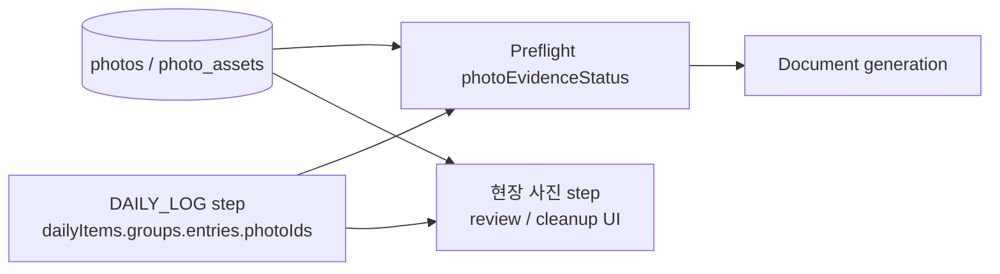
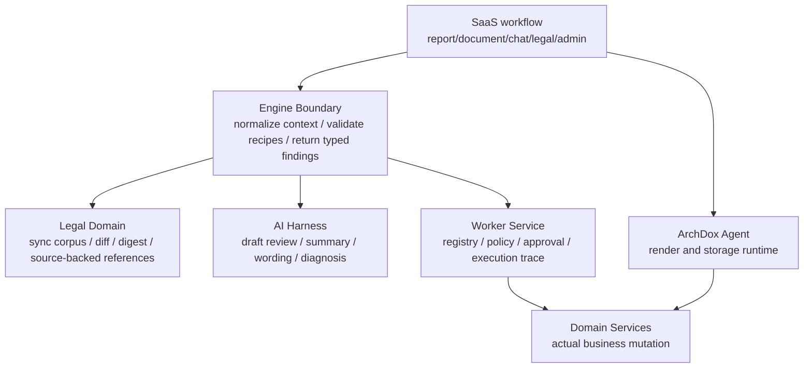
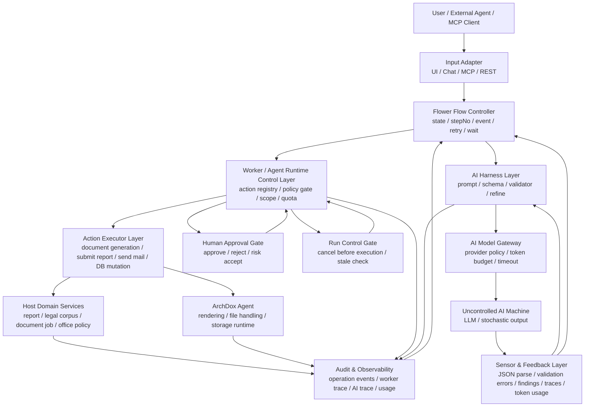
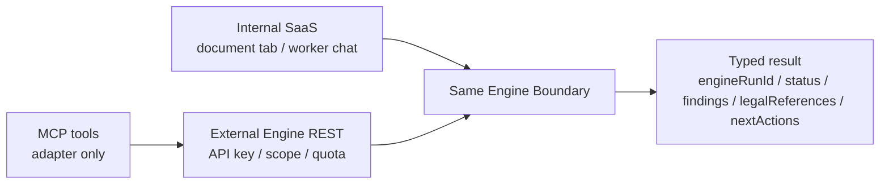
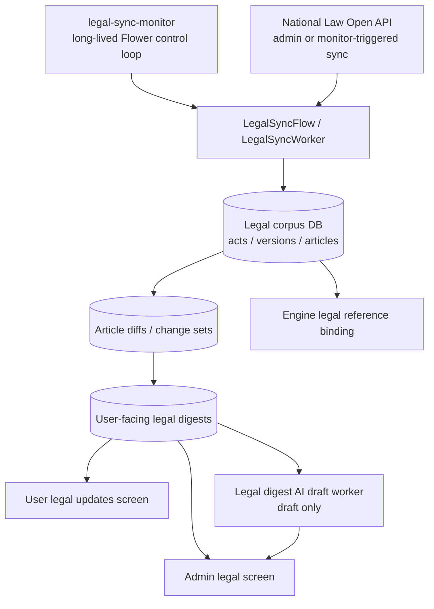
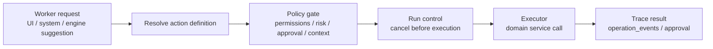
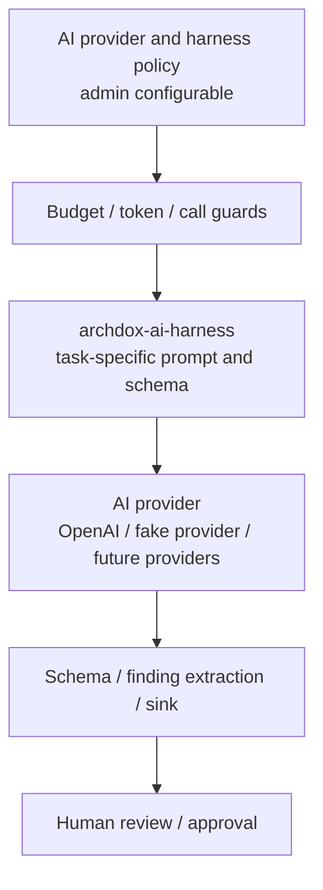

# ArchDox System Map

Last updated: 2026-06-10

This document is the entry map for the current ArchDox system. It does not
replace the focused architecture documents. Use it to understand where each
module belongs, which layer owns which responsibility, and which detailed
document to open next.

## One Page Map

ArchDox is a construction-supervision document workflow platform. The source of
truth is structured business data, not DOCX/PDF files.



## Runtime Modules

| Module | Current Role | Must Not Own |
| --- | --- | --- |
| `cloud-api` | SaaS REST API, auth, permissions, office/project/site/report/photo/document/admin/legal/engine application services, Flower workers, DB state. | Inline document rendering, free-form AI tool execution, office NAS paths. |
| `client/web` | User app for project/site/report/photo/chat/document/legal updates. | Platform admin operations or direct storage access. |
| `admin` | Platform admin UI for offices, users, agents, legal sync, AI management, worker governance, Engine API keys, usage, evaluation. | Normal user report authoring. |
| `public-site` | Static public product/developer pages. | Authenticated SaaS workflows. |
| `archdox-agent` | Registered execution runtime for document rendering, artifact handling, photo pickup, local/NAS/S3 storage profiles. | AI agent behavior, permissions, business policy. |
| `document-engine` | Deterministic renderer library for document outputs. | Report workflow, legal review, AI, permissions, DB state. |
| `archdox-worker` | Controlled action model: registry, policy gate, execution result, trace, approval-ready action envelope. | Rendering, model prompts, legal corpus ownership. |
| `archdox-ai-harness` | ArchDox-specific harnesses such as preflight review, ops diagnosis, planner proposal, legal digest draft. | Business mutation or final approval decisions. |
| `flower-core` | Generic flow/step runtime. | ArchDox domain policy or tenant business state. |
| `domain-shared` | Shared domain value types used across modules. | Application services or persistence. |

## Flower Worker Lanes

Cloud API Flower workers are execution lanes, not feature names. A new feature
should not create a new worker unless it has a distinct blocking, priority,
isolation, or concurrency profile.

Current direction:

| Lane | Responsibility | Notes |
| --- | --- | --- |
| `document-io` | Photo derivative generation, photo pickup, document generation, document delivery orchestration. | Shared lane because these flows delegate heavy work to bounded executors or ArchDox Agent commands and wait by future/event/state. |
| `monitoring` | Long-lived control loops such as Agent connection health, legal sync monitor, and platform ops daily report monitor. | Uses `stepNo` and timeout-based waiting. |
| `document-review` | Deterministic document/report review orchestration. | Can absorb more non-blocking review flows over time. |
| `ai-harness` | AI child harness execution for document AI review, report preflight AI review, source-backed legal review AI, platform ops diagnosis AI, document narrative polish AI, worker chat planner AI, and legal digest draft AI. | Workflow type names remain task-specific, but they share one execution lane because they have the same bounded AI execution character and model calls are protected by the provider bulkhead. Narrative polish, worker chat planner, and legal digest draft are still synchronous from the caller's perspective, but they no longer own dedicated Flower worker lanes. |
| `legal-sync` | Law Open Data sync execution. | Still isolated because Law Open Data calls are slow external I/O. The official Open API client uses async HTTP and async throttle/retry delays; fallback blocking source clients are isolated behind the bounded `legal-sync-fetch-*` executor. The Flower fetch step observes completion by `stepNo`, so the Flower worker tick is not held while HTTP/retry waits run. |
| `archdox-worker` | Controlled SaaS action execution: policy, approval, run control, audit trace. | Separate from AI harness and Agent document rendering. Long-running actions must implement the async action executor contract so the worker lane observes completion instead of blocking inside `execute()`. |

AI provider calls inside `ai-harness` are protected by the bounded
`ai-model-gateway-*` executor. This keeps the shared AI lane from becoming an
unbounded provider-call fan-out point when many harness requests arrive at once.
Flower workers are orchestration lanes and must not sleep or block on child
flows, HTTP calls, AI provider calls, or retry waits. Detailed async execution
and exception-approval rules live in
[`docs/development/DDD_EVENT_ORCHESTRATION_RULES.md`](../development/DDD_EVENT_ORCHESTRATION_RULES.md).

## Core Business Flow

This is the current construction-supervision MVP path.



## Source Of Truth

The durable business source is PostgreSQL. Generated documents are artifacts.

| Data Area | Main Source |
| --- | --- |
| Tenant and permissions | users, offices, memberships, invitations, assignments |
| Project/site context | projects, sites, report targets |
| Report authoring | inspection reports, report steps, report revision state |
| Daily supervision ledger | site supervision entries projected from canonical `DAILY_LOG` payload |
| Photos | photos, photo assets, storage refs, status, working/thumbnail/original state |
| Document output | document jobs, document artifacts, delivery metadata |
| Agent runtime | ArchDox Agent rows, sessions, commands, heartbeats |
| Worker governance | operation events, worker approvals, Worker trace events |
| Engine API | review sessions, API keys, usage events, quota metadata |
| Legal corpus | legal source, act, version, article, diff, change set, digest tables |
| AI operation | providers, harness policies, budget/usage logs, evaluations |

## Report And Photo Model

For construction daily supervision logs, photos are not primarily owned by a
`PHOTOS` step payload.



Current rule:

```text
photos table + DAILY_LOG photoIds = construction supervision photo evidence
PHOTOS payload empty = not an error for construction daily supervision logs
unlinked report photos = warning / cleanup signal
missing referenced photos or missing working assets = blocking issue
```

## Engine, Worker, AI, Agent

These are separate control layers. Do not collapse them into one "agent".



Responsibility split:

| Layer | Can Decide | Can Execute Mutation |
| --- | --- | --- |
| Engine Boundary | Typed findings, legal references, next actions, suggested Worker actions. | No. |
| AI Harness | Draft findings, summaries, suggestions, wording proposals. | No. |
| Worker Service | Whether a registered action may execute, whether approval is needed, how result is traced. | Yes, through domain services only. |
| Domain Services | Business invariants and persistence. | Yes. |
| ArchDox Agent | Render/store artifacts after Cloud command. | Only agent command side effects, not SaaS business policy. |

## AI Machine Control Concept

ArchDox treats an AI model as an uncontrolled probabilistic machine. The
platform does not make the model trusted by giving it more authority. Instead,
ArchDox wraps the model in explicit control layers so the complete system can be
observed, interrupted, authorized, audited, and improved.

```text
AI is a controlled plant, not the final controller.
```

This is the ArchDox interpretation of the future `flower-agent-runtime`
direction. The common runtime may later extract generic action registry,
policy, approval, run-control, executor, trace, and async execution contracts.
ArchDox remains the host application that owns office permissions, report
state, legal corpus, supervision catalogs, document jobs, and UI approval
states.



Layer mapping:

| Control Concept | ArchDox Layer | Responsibility |
| --- | --- | --- |
| Uncontrolled plant | LLM / AI provider model | Produces probabilistic text or JSON. It owns no authority. |
| Drive/interface | AI Harness | Builds prompt, enforces schema, validates output, refines invalid responses, extracts findings or drafts. |
| State controller | Flower Flow | Orchestrates steps, waits by `stepNo`/event/state, handles retry/timeout/recovery. |
| Safety controller | Worker / future Agent Runtime | Resolves action definitions, checks policy, approval, cancel/stale state, and audit requirements. |
| Actuator | Executor / Domain Service / ArchDox Agent | Performs the actual side effect after runtime control gates pass. |
| Sensors | Findings, validation errors, trace events, usage logs | Feed back into UI, admin observation, evaluation, and future tuning. |

Important rule:

```text
AI Harnesses may produce draft findings, wording suggestions, summaries, or
action proposals.

They must not directly execute controlled actions.

Execution begins only when a Flower flow, service, UI confirmation, or external
Engine/MCP request submits a registered action to the Worker/Agent Runtime
control boundary.
```

Human approval is runtime state, not AI output. An AI response may recommend
approval, but only a durable approval record created by an authorized human can
open the approval gate.

Typical controlled action path:

```text
AI/user/system suggests or requests action
-> Flower flow decides whether to submit an action request
-> Worker/Agent Runtime resolves the registered action
-> policy/scope/quota/context checks
-> approval gate if required
-> run-control cancel/stale check
-> executor dispatch
-> domain/agent side effect
-> trace/audit/result feedback
```

Do not collapse this into "AI agent executes a task". In ArchDox, AI suggests,
Flower orchestrates, Worker/Agent Runtime controls, and executors mutate.

## External Engine And MCP Direction

The current implementation keeps the Engine inside `cloud-api`. External
Engine REST and MCP must use the same boundary as internal SaaS.



Current external/MCP tool direction:

| Capability | Current Direction |
| --- | --- |
| `validate_inspection_report` | Engine review-session validation around normalized context. |
| `get_legal_updates` | Legal digest read model, usage/quota scoped. |
| `search_law` | DB-backed legal corpus search, not live law.go.kr per request. |
| `get_law_article` | DB-backed article lookup with source/version metadata. |
| `explain_legal_change` | Published legal digest detail with source-backed article diffs. |

MCP is not the core engine. It is an adapter over the external Engine API.

## Legal Domain Map



Important rule:

```text
AI may summarize or draft explanations.
AI must not mutate official legal corpus, article text, source versions, or
published legal facts.
```

## Worker Governance Map



Current principle:

```text
User/system/AI/Engine may request or suggest.
Only registered Worker actions may execute.
Execution goes through policy, approval/cancel gates, Flower flow, trace, and
domain services. If a registered action waits on AI harness, external I/O, or a
slow child flow, it should expose an async action future. The `archdox-worker`
lane records `ACTION_STARTED`, moves to a waiting `stepNo`, and records the
terminal result only after the future completes.
```

## AI Harness Map



Current AI use cases:

| Harness / Area | Output Type | Final Authority |
| --- | --- | --- |
| Report preflight review | Draft findings and wording/compliance hints. | Human user and deterministic gate. |
| Legal digest enrichment | Draft title/summary/impact notes. | Platform admin before publishing. |
| Platform ops diagnosis | Redacted diagnosis snapshot. | Platform operator. |
| Worker chat planner | Proposal card. | User confirmation and Worker policy. |
| Evaluation suite | Scored checks for AI/Worker control quality. | Platform/operator interpretation. |

## Operational Monitor Flows

Periodic platform work should be modeled as long-lived Flower control loops
when the work needs skip decisions, duplicate prevention, audit events, and
operator visibility.

Current monitor flows run on the shared `monitoring` Flower worker:

| Flow | Responsibility | Child Work |
| --- | --- | --- |
| `agent-connection-health-monitor` | Detect stale ArchDox Agent sessions. | Marks timed-out sessions disconnected. |
| `legal-sync-monitor` | Checks configured Open API due slots such as 03:00 and 15:00. | Submits the existing `legal-sync` flow only when the due slot has not already been handled. Concurrent manual/monitor requests are single-flight guarded by the `RUNNING` sync run state. |
| `platform-ops-daily-report-monitor` | Checks the daily operations report due slot. | Generates a sanitized `AUTO_DAILY_REPORT` run and Markdown report file. |
| `server-runtime-health-monitor` | Samples Cloud API host CPU, system memory pressure, and JVM heap. | Keeps the latest sample in memory and records only high-load operation events. |

These are not ad-hoc Spring schedulers. The Flower flow owns the periodic
decision, while durable business state remains in DB rows and operation events.

## Deployment Hosts

| Host | Purpose |
| --- | --- |
| `https://archdox.co.kr` | Public product/developer site. |
| `https://app.archdox.co.kr` | Office user app. |
| `https://admin.archdox.co.kr` | Platform admin app. |
| `https://api.archdox.co.kr` | Cloud API. |
| `https://mcp.archdox.co.kr/api/v1/mcp` | MCP JSON-RPC gateway route. Other paths redirect to public MCP documentation. |

Current deployment is a Lightsail-hosted Docker Compose stack with Caddy/Nginx
host routing. Multi-instance Cloud API operation remains a future phase.

## Document Reading Routes

Use this map first, then open focused documents.

| Question | Next Document |
| --- | --- |
| What is ArchDox as a product? | [ARCHDOX_PLATFORM_IDENTITY.md](ARCHDOX_PLATFORM_IDENTITY.md) |
| What are the core domain objects? | [DOMAIN_MODEL.md](DOMAIN_MODEL.md) |
| How does Engine differ from Worker/Agent/document-engine? | [ARCHDOX_ENGINE_BOUNDARY.md](ARCHDOX_ENGINE_BOUNDARY.md) |
| How does external Engine/MCP fit? | [ARCHDOX_MCP_GATEWAY_STRATEGY.md](ARCHDOX_MCP_GATEWAY_STRATEGY.md) |
| How does ArchDox Agent work? | [ARCHDOX_AGENT_ARCHITECTURE.md](ARCHDOX_AGENT_ARCHITECTURE.md) |
| How does legal sync/digest work? | [LEGAL_DOMAIN_ARCHITECTURE.md](LEGAL_DOMAIN_ARCHITECTURE.md) |
| How is AI provider/policy managed? | [AI_PROVIDER_POLICY.md](AI_PROVIDER_POLICY.md) and [../ai-harness/README.md](../ai-harness/README.md) |
| How should front-end flow be organized? | [UI_WORKFLOW_ORCHESTRATION.md](UI_WORKFLOW_ORCHESTRATION.md) and [FRONTEND_ARCHITECTURE.md](FRONTEND_ARCHITECTURE.md) |
| How do photos and storage work? | [IMAGE_UPLOAD_POLICY.md](IMAGE_UPLOAD_POLICY.md) |
| How is construction supervision catalog managed? | [CONSTRUCTION_SUPERVISION_DOMAIN_CATALOG.md](CONSTRUCTION_SUPERVISION_DOMAIN_CATALOG.md) |

## Current System Edges To Watch

These are intentional boundaries that should not be blurred during future work.

| Edge | Why It Matters |
| --- | --- |
| Report data vs generated files | Structured data is reusable; DOCX/PDF are outputs. |
| Engine vs Worker | Engine reviews and suggests; Worker governs and executes. |
| AI Harness vs Worker | AI proposes draft findings or proposals; Worker/domain services mutate. |
| ArchDox Agent vs AI agent | ArchDox Agent renders/stores files; it is not an LLM agent. |
| Legal corpus vs AI digest | Legal corpus is official/source-backed; AI digest is explanatory draft. |
| `photos` table vs `PHOTOS` step payload | Construction daily supervision photo evidence is `photos + DAILY_LOG photoIds`. |
| Flower runtime vs business state | Flower executes flows; durable state stays in DB/domain records. |

## Maintenance Rule

Update this file when a new subsystem changes the top-level map, for example:

- a new process/service is introduced
- Engine or MCP moves out of `cloud-api`
- a new major AI harness family is added
- legal review becomes a distinct source-backed harness
- document generation routing changes
- Worker actions gain a new governance phase
- deployment host or runtime topology changes

Do not add every class or endpoint here. Keep this as the map, and link to
focused documents for detail.
