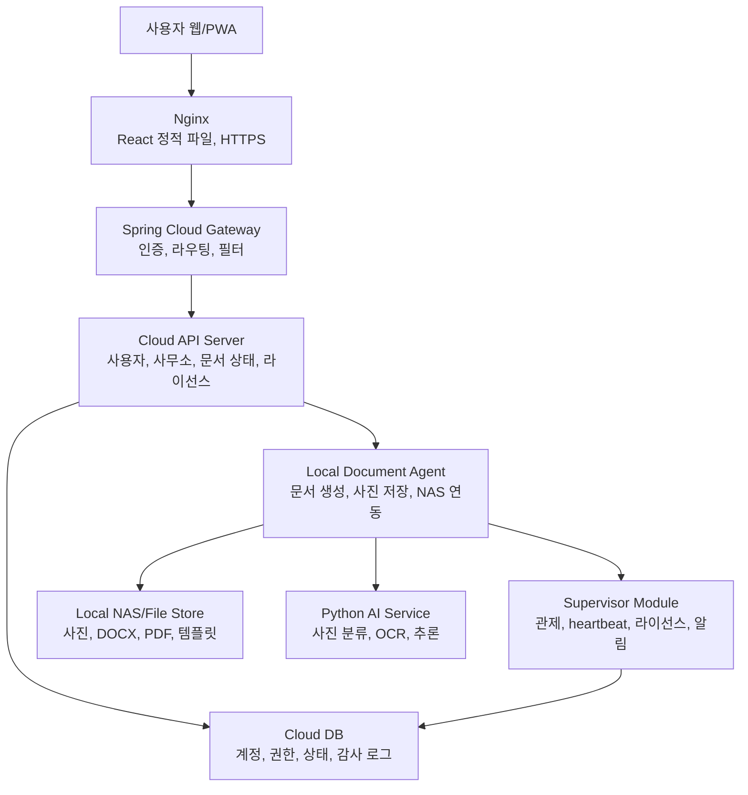

# 건축 문서 자동화 시스템 개발 구현 계획

작성일: 2026-05-19
원본 문서: 내부 상세 설계 문서
참고 코드베이스: Flower/Bloom 샘플 코드베이스

## 1. 결론

이 시스템은 단순히 Word/PDF를 만드는 도구가 아니라, 건축사무소의 감리일지, 정기점검 보고서, 사진 정리, 문서 생성 이력, 로컬 문서 보관, 중앙 관제까지 포함하는 하이브리드 문서 자동화 플랫폼으로 보는 것이 맞다.

가장 현실적인 1차 구조는 다음이다.



단, MVP에서는 `Supervisor Module`을 별도 서버로 분리하지 말고 Cloud API 안의 모듈로 시작하는 것을 권장한다. 별도 슈퍼 서버는 운영 고객이 생기고 원격 업데이트, 장애 관제, 기능별 과금이 필요해진 뒤 분리해도 늦지 않다.

## 2. 원본 문서에서 추출한 핵심 요구사항

- 사용자는 웹에 로그인해서 자기 사무소의 문서 작성 상태와 히스토리만 본다.
- 사용자는 실제 생성된 문서 파일을 웹에서 직접 열람하지 않는 구조를 선호한다.
- 감리일지와 정기점검 보고서가 1차 자동화 대상이다.
- 사진 업로드, 체크리스트 입력, 단계별 저장, 문서 생성 요청, 완료 알림이 필요하다.
- 실제 문서, 사진 원본, 도면 원본은 사무소 로컬 NAS 또는 로컬 디스크에 저장한다.
- 클라우드는 사용자 인증, 문서 진행 상태, 라이선스, 관제, 알림을 담당한다.
- 로컬 문서 서버는 Word 템플릿 바인딩, PDF 생성, NAS 저장, 프린터 출력 같은 내부 작업을 담당한다.
- AI는 처음부터 완전 자동 분류로 가지 말고, 사용자 선택과 피드백을 받아 점진적으로 정확도를 높인다.
- 세움터/e행정 시스템은 자동 입력이 어렵거나 위험하므로, 1차 목표는 제출용 문서 품질과 작성 시간을 줄이는 것이다.

## 3. 원본 문서에서 이상하거나 보완할 점

### 3.1 클라우드가 "프록시만" 한다는 설명은 부족하다

원문 중간에는 클라우드가 저장을 전혀 하지 않는 프록시 구조가 나오고, 뒤에서는 클라우드 DB가 필요하다는 결론이 나온다. 최종적으로는 후자가 맞다.

다만 클라우드 DB에 무엇을 저장할지는 분리해야 한다.

- 클라우드에 저장해도 되는 것: 사용자, 사무소, 프로젝트 식별자, 문서 상태, 단계 진행률, 작업 이력, 라이선스, heartbeat, 알림 이력
- 로컬에 저장해야 하는 것: 실제 사진 원본, 생성된 DOCX/PDF, 도면 원본, NAS 경로, 템플릿 원본
- 정책에 따라 선택할 것: 감리일지 입력 상세값, 체크리스트 답변, 메모

보안 신뢰를 우선하면 클라우드는 문서 상세 내용까지 들고 있지 말고, 문서 생성에 필요한 payload는 로컬 서버가 보관하는 편이 낫다. 사용자가 웹에서 단계별 입력을 한다면 Cloud API가 relay하고, ArchDox Agent가 draft payload를 저장하는 방식이 안전하다.

### 3.2 클라우드에서 로컬 서버를 직접 호출하는 방식은 운영 난도가 높다

원문에는 `Cloud API -> Local Server HTTP 호출`이 자주 등장한다. 이 방식은 VPN, 고정 IP, 터널, 방화벽 정책이 필요하다.

MVP에서는 다음 중 하나를 선택한다.

1. 단일 사무소 설치형 MVP: 모든 서버를 로컬 네트워크 안에서 실행한다.
2. 하이브리드 MVP: ArchDox Agent가 클라우드에 outbound 연결을 열고 명령을 polling 또는 WebSocket으로 받아간다.
3. 운영형 하이브리드: VPN 또는 Cloudflare Tunnel을 구성해 Cloud API가 ArchDox Agent에 안전하게 접근한다.

권장 순서는 1 -> 2 -> 3이다. 처음부터 VPN/터널/다중 사무소를 모두 구현하면 범위가 너무 커진다.

### 3.3 Gateway와 Nginx는 MVP에서 과할 수 있다

운영 구조에서는 `Nginx -> Gateway -> API Server`가 좋다. 하지만 초기 MVP에서는 다음처럼 단순화해도 된다.

- React 정적 파일은 Nginx 또는 Spring Boot static hosting 중 하나로 시작
- API 서버가 하나라면 Spring Cloud Gateway는 생략 가능
- 서비스가 2개 이상으로 분리되고 인증/라우팅 정책이 커질 때 Gateway 도입

클로드에게 구현시킬 때는 "최종 구조는 Gateway를 고려하되, MVP는 Cloud API 단일 Spring Boot 앱으로 시작"을 기본값으로 둔다.

### 3.4 슈퍼 서버는 초기에 별도 앱으로 분리하지 않는다

원문에서는 슈퍼 서버를 별도 서버로 개발하는 방향이 나온다. 장기적으로는 맞지만, 초기에 Cloud API, Gateway, Supervisor, ArchDox Agent, AI, Frontend를 모두 별도 앱으로 만들면 관리 비용이 먼저 터진다.

권장:

- 1단계: Cloud API 안에 `supervisor` 패키지로 heartbeat, license, notification을 구현
- 2단계: 운영 고객이 늘면 Supervisor 서버로 분리
- 3단계: 원격 업데이트, 기능별 과금, 장애 대시보드를 독립 배포

### 3.5 AI 학습 자동화는 MVP 범위가 아니다

사진 분류 AI는 매력적이지만, 초기에는 데이터가 없다. 처음부터 자체 학습 파이프라인을 만들기보다 다음 순서가 낫다.

- 사용자가 카테고리를 직접 선택해서 사진 촬영 또는 업로드
- AI는 선택값 보조용 top-3 추천만 제공
- 사용자가 확정한 라벨을 `photo_label_feedback`으로 저장
- 라벨 데이터가 충분히 쌓인 후 재학습 배치 도입

### 3.6 문서 생성 라이브러리 선택 주의

원문에 iText가 언급되지만, iText는 라이선스 이슈가 있을 수 있다. 상용 서비스라면 라이선스를 확인해야 한다.

권장:

- DOCX 템플릿 바인딩: Java `docx4j` 우선 검토
- DOCX -> PDF 변환: LibreOffice headless 또는 상용 변환 엔진 검토
- PDF 직접 생성: OpenPDF, PDFBox, 상용 라이브러리 중 라이선스 확인 후 선택
- HWP/HWPX: MVP 제외. 관공서 양식 때문에 필요하면 별도 모듈로 검토

## 4. abyss-runner에서 가져올 구현 철학

참고 파일:

- Flower/Bloom server architecture reference
- Flower/Bloom guidelines reference
- Flower/Bloom configuration reference
- Flower flow factory reference
- Bloom listener reference

### 4.1 패키지 원칙

기능별 패키지로 나눈다.

```text
com.archdoc
  account
  office
  project
  inspection
  photo
  document
  template
  agent
  supervisor
  license
  notification
  audit
  global
```

컨트롤러는 HTTP 요청/응답 변환만 담당한다. 실제 판단은 application service, use case, workflow step으로 보낸다.

### 4.2 Bloom 이벤트 기준

Bloom은 내부 도메인 이벤트 표준 수단으로 사용한다. HTTP, WebSocket, ArchDox Agent callback 같은 외부 입력 방식이 바뀌어도 도메인 로직이 흔들리지 않게 한다.

사용하기 좋은 곳:

- 문서 생성 요청 이후 후속 처리
- 문서 생성 완료 후 알림
- 사진 업로드 이후 AI 분류 요청
- 로컬 서버 heartbeat 수신 이후 관제 상태 갱신
- 라이선스 사용량 증가 이후 초과 경고
- 감사 로그, 운영 로그, KPI 이벤트

직접 유스케이스 호출이 나은 곳:

- 로그인, 회원가입, 토큰 재발급
- 문서 draft 단계 저장처럼 즉시 성공/실패를 반환해야 하는 요청
- 단일 트랜잭션 안에서 순서가 중요한 상태 변경
- 실패 원인을 사용자에게 바로 반환해야 하는 명령

### 4.3 Flower workflow 기준

Flower는 "여러 단계가 있고, 실패/재시도/중복 방지/상태 관측이 필요한 작업"에 쓴다.

적합한 workflow:

- 문서 생성 job
- 사진 일괄 AI 분류 job
- 이메일 발송 job
- 로컬 서버 업데이트 job
- 월간 사용량 집계 job

적합하지 않은 workflow:

- 단순 조회 API
- 단일 DB update
- 즉시 응답해야 하는 간단한 command

## 5. 핵심 도메인 이벤트 제안

```text
InspectionDraftCreatedEvent
InspectionDraftStepSavedEvent
InspectionSubmittedEvent
PhotoUploadedEvent
PhotoClassificationRequestedEvent
PhotoClassifiedEvent
PhotoLabelConfirmedEvent
DocumentGenerationRequestedEvent
DocumentGeneratedEvent
DocumentGenerationFailedEvent
DocumentDeliveryRequestedEvent
DocumentEmailSentEvent
ArchDoxAgentHeartbeatReceivedEvent
ArchDoxAgentOfflineDetectedEvent
LicenseFeatureCheckedEvent
LicenseUsageExceededEvent
```

이벤트 이름은 과거형 또는 상태 진입형으로 둔다. 핵심 상태 변경은 이벤트 핸들러 여러 곳에 흩뿌리지 말고, 한 유스케이스 또는 Flower step의 소유로 둔다. 이벤트는 후속 기능 확장에 쓴다.

## 6. Flower workflow 설계

### 6.1 문서 생성 Flow

`reportId`를 flow key로 사용한다. 중복 생성 요청은 `DuplicatePolicy.IGNORE` 또는 상태에 따라 `REPLACE`를 선택한다.

```text
FLOW_TYPE = "inspection-document-generation"
FLOW_KEY = reportId

steps:
  1. validate-report-request
  2. reserve-local-workspace
  3. collect-report-payload
  4. prepare-photos
  5. classify-photos-optional
  6. render-docx
  7. convert-pdf
  8. save-artifacts
  9. report-completion
  10. publish-document-generated
```

실패 정책:

- `validate-report-request` 실패: 즉시 FAILED, 사용자 수정 필요
- `prepare-photos` 실패: 누락 사진 목록 저장, 재시도 가능
- `render-docx` 실패: 템플릿/데이터 오류로 분류
- `convert-pdf` 실패: DOCX는 남기고 PDF 변환만 재시도 가능
- `report-completion` 실패: 로컬 결과는 보존하고 Cloud API callback 재시도

### 6.2 AI 사진 분류 Flow

```text
FLOW_TYPE = "photo-classification"
FLOW_KEY = reportId or photoBatchId

steps:
  1. load-photo-batch
  2. call-ai-service
  3. save-predictions
  4. request-human-confirmation
  5. publish-photo-classified
```

AI 결과는 정답이 아니라 추천이다. `confidence`가 낮으면 사람 확정을 요구한다.

### 6.3 로컬 서버 업데이트 Flow

초기 MVP 제외. 운영 단계에서만 구현한다.

```text
FLOW_TYPE = "archdox-agent-update"
FLOW_KEY = agentId + targetVersion

steps:
  1. validate-license-and-agent
  2. create-update-command
  3. wait-agent-ack
  4. wait-agent-updated
  5. verify-agent-version
  6. publish-agent-updated
```

원격 업데이트는 임의 명령 실행이 아니라 allowlist command만 허용해야 한다.

## 7. 주요 컴포넌트

### 7.1 Cloud API Server

역할:

- 로그인, 사용자, 사무소, 권한 관리
- 문서 draft 상태와 진행률 관리
- 문서 생성 job 생성
- ArchDox Agent 명령 발행
- 문서 상태 조회 API 제공
- 알림, 이메일, 사용량 집계
- supervisor 기능의 초기 구현 위치

권장 기술:

- Java 21
- Spring Boot 3.5 이상
- Spring Security
- Spring Data JPA
- PostgreSQL
- Flyway
- Bloom, Flower
- Actuator, Micrometer

### 7.2 Local Document Agent

역할:

- 로컬 NAS 또는 파일 시스템 접근
- 사진 원본 저장
- 문서 payload 저장
- Word 템플릿 바인딩
- PDF 변환
- 로컬 프린터 출력
- Cloud API에 완료/실패 보고
- AI 서비스 호출
- heartbeat 보고

권장 구현:

- Spring Boot 앱으로 시작
- Windows 서비스 또는 Linux systemd 서비스로 설치 가능하게 구성
- 로컬 데이터 루트 예: `D:\ArchDoc\data` 또는 `/var/archdoc/data`

로컬 저장 구조:

```text
data/
  offices/{officeCode}/
    reports/{reportId}/
      input/
        payload.json
        photos/
          original/
          resized/
          thumbnail/
      output/
        report.docx
        report.pdf
      logs/
        generation.log
    templates/
      inspection-daily-v1.docx
      periodic-inspection-v1.docx
```

### 7.3 Python AI Service

역할:

- 사진 category 추천
- OCR 또는 이미지 품질 검사
- 장기적으로 재학습

MVP 범위:

- FastAPI `POST /predict`
- 입력: 이미지 파일 또는 로컬 파일 경로
- 출력: top-3 label, confidence
- 사람이 확정한 label을 Cloud API 또는 ArchDox Agent에 feedback으로 저장

처음부터 학습 파이프라인을 만들지 않는다.

### 7.4 Frontend

역할:

- 로그인
- 사무소/프로젝트 선택
- 감리일지 단계별 입력
- 사진 업로드
- 카테고리 확정
- 문서 생성 요청
- 진행 상태 조회
- 완료 알림

MVP는 React + Vite + TypeScript 권장.

화면 우선순위:

1. 로그인
2. 프로젝트 목록
3. 감리일지 draft 목록
4. 단계별 작성 화면
5. 사진 업로드/분류 화면
6. 문서 생성 상태 화면
7. 관리자 설정 화면

## 8. 데이터 모델 초안

Cloud DB:

```text
offices
  id
  office_code
  name
  status
  created_at

users
  id
  office_id
  email
  password_hash
  role
  status

projects
  id
  office_id
  name
  address
  status

inspection_reports
  id
  office_id
  project_id
  report_no
  report_type
  title
  status
  current_step
  requested_by
  archdox_agent_id
  created_at
  updated_at

inspection_report_steps
  id
  report_id
  step_code
  status
  saved_at

document_jobs
  id
  report_id
  job_type
  status
  requested_by
  started_at
  completed_at
  error_code
  error_message

document_artifacts
  id
  report_id
  artifact_type
  local_path_hash
  file_name
  file_size
  created_at

archdox_agents
  id
  office_id
  agent_code
  version
  status
  last_seen_at
  license_status

archdox_agent_heartbeats
  id
  agent_id
  status
  version
  disk_free_bytes
  recent_error_count
  received_at

feature_entitlements
  id
  office_id
  feature_code
  enabled
  monthly_limit
  expires_at

feature_usage_counters
  id
  office_id
  feature_code
  period_yyyymm
  used_count

notification_events
  id
  office_id
  target_user_id
  channel
  status
  subject
  sent_at

audit_logs
  id
  office_id
  actor_user_id
  action
  target_type
  target_id
  metadata_json
  created_at
```

Local Store:

```text
report_payload.json
photo_metadata.json
generation_result.json
```

로컬에도 DB가 필요하면 SQLite 또는 PostgreSQL을 선택한다. 단, 로컬 DB는 문서 생성 payload와 파일 인덱싱 용도로 제한하고, 사용자/라이선스의 정본은 Cloud DB로 둔다.

## 9. API 초안

### 9.1 Cloud API

```http
POST /api/v1/auth/login
GET  /api/v1/me

GET  /api/v1/projects
POST /api/v1/projects

GET  /api/v1/inspection-reports
POST /api/v1/inspection-reports
GET  /api/v1/inspection-reports/{reportId}
PUT  /api/v1/inspection-reports/{reportId}/steps/{stepCode}
POST /api/v1/inspection-reports/{reportId}/photos
POST /api/v1/inspection-reports/{reportId}/generate
GET  /api/v1/inspection-reports/{reportId}/status

GET  /api/v1/events/stream
```

문서 파일 다운로드 API는 MVP에서 만들지 않는다. 필요하면 관리자 권한 또는 만료 링크 기반으로 별도 검토한다.

### 9.2 Cloud API - ArchDox Agent 연동

권장 MVP는 ArchDox Agent가 명령을 가져가는 pull 방식이다.

```http
POST /api/v1/agents/{agentCode}/heartbeat
GET  /api/v1/agents/{agentCode}/commands/next
POST /api/v1/agents/{agentCode}/commands/{commandId}/ack
POST /api/v1/agents/{agentCode}/jobs/{jobId}/complete
POST /api/v1/agents/{agentCode}/jobs/{jobId}/fail
```

이 방식은 클라우드가 로컬 서버로 직접 들어가지 않아도 된다.

### 9.3 ArchDox Agent Internal API

로컬 내부 또는 Cloud API 전용으로만 노출한다.

```http
GET  /internal/v1/health
POST /internal/v1/reports/{reportId}/generate
POST /internal/v1/photos/{photoId}/classify
POST /internal/v1/admin/reload-template
```

외부 공개 금지. 인증 토큰, IP allowlist, mTLS 중 하나 이상을 적용한다.

### 9.4 Python AI API

```http
POST /ai/v1/predict/photo-category
POST /ai/v1/feedback/photo-label
GET  /ai/v1/models/current
```

## 10. 상태 정의

문서 상태:

```text
DRAFT
STEP_SAVED
READY_TO_GENERATE
GENERATION_REQUESTED
GENERATING
GENERATED
DELIVERY_REQUESTED
DELIVERED
FAILED
CANCELLED
```

Job 상태:

```text
CREATED
QUEUED
PROCESSING
WAITING_ARCHDOX_AGENT
COMPLETED
FAILED
RETRYING
```

ArchDox Agent 상태:

```text
ONLINE
DEGRADED
OFFLINE
UPDATING
DISABLED
LICENSE_EXPIRED
```

## 11. 보안 원칙

- 로컬 NAS와 생성 문서는 인터넷에 직접 노출하지 않는다.
- 클라이언트는 Cloud API만 호출한다.
- Cloud API는 사용자와 office 권한을 반드시 검증한다.
- ArchDox Agent는 Cloud API에서 발행한 service token만 신뢰한다.
- 파일 업로드는 확장자, MIME, 크기, 이미지 디코딩 가능 여부를 모두 검증한다.
- 파일 저장 경로는 reportId 기반 allowlist path로만 생성한다.
- `../` 경로 탈출을 막는다.
- 문서 파일 경로 원문은 Cloud DB에 그대로 저장하지 않고 hash 또는 logical key로 저장한다.
- 원격 명령은 allowlist command만 허용한다.
- 관리자 명령, 문서 생성, 이메일 발송, 라이선스 차단은 모두 audit log로 남긴다.

## 12. MVP 범위

1차 MVP에 포함:

- 단일 Cloud API 앱
- 단일 Local Document Agent 앱
- React 웹
- PostgreSQL Cloud DB
- 로컬 파일 저장소
- 감리일지 draft 생성/저장
- 사진 업로드
- 문서 생성 요청
- ArchDox Agent 문서 생성 flow
- DOCX/PDF 저장
- 상태 조회
- heartbeat
- 기본 라이선스 feature check

1차 MVP에서 제외:

- 완전한 슈퍼 서버 분리
- 원격 자동 업데이트
- 다중 API 서버 로드밸런싱
- 자체 AI 재학습 파이프라인
- HWP 생성
- 세움터 자동 입력
- 복잡한 과금 결제
- 문서 웹 미리보기

## 13. 구현 순서

### Phase 0. 프로젝트 뼈대

- Gradle multi-module 또는 monorepo 구성
- `cloud-api`, `archdox-agent`, `frontend`, `ai-service` 디렉터리 분리
- Docker Compose로 Cloud DB, Cloud API, ArchDox Agent를 개발 환경에서 실행
- 공통 규칙: Java 21, Spring Boot 3.5 이상, Flyway, Testcontainers

### Phase 1. Cloud API 기본 도메인

- office, user, project, inspection_report, document_job 테이블 생성
- Spring Security JWT 로그인
- office별 권한 필터
- report draft 생성/조회/상태 변경 API
- audit log 저장

### Phase 2. ArchDox Agent 기본 동작

- local data root 설정
- health endpoint
- heartbeat 전송
- command polling
- report payload 저장
- 사진 저장
- 작업 완료/실패 callback

### Phase 3. 문서 생성 Flower Flow

- `DocumentGenerationFlowFactory`
- `DocumentGenerationWorker`
- step 구현
- `DocumentGenerationRequestedEvent`를 받으면 flow submit
- 중복 요청 방지
- 실패 시 job 상태와 error 저장

### Phase 4. 템플릿 바인딩

- 감리일지 DOCX 템플릿 v1 제작
- payload JSON -> DOCX 바인딩
- 사진 2x2 또는 항목별 그룹 배치
- DOCX -> PDF 변환
- output 파일 저장

### Phase 5. Frontend

- 로그인
- 프로젝트 선택
- 감리일지 작성 wizard
- 사진 업로드
- 문서 생성 버튼
- 상태 polling 또는 SSE

### Phase 6. AI 보조 분류

- Python FastAPI service
- ArchDox Agent에서 AI 호출
- top-3 추천 저장
- 사용자 확정 label 저장

### Phase 7. Supervisor 확장

- heartbeat 대시보드
- 관리자 이메일 등록
- offline 감지
- 이메일 알림
- feature entitlement와 usage counter

## 14. 클로드에게 줄 구현 지시 기준

클로드가 구현할 때 다음 원칙을 지킨다.

- 처음부터 모든 서버를 완성하지 않는다.
- 먼저 Cloud API와 ArchDox Agent의 문서 생성 happy path를 만든다.
- Flower는 장기 작업에만 쓴다.
- Bloom은 후속 처리 이벤트에만 쓴다.
- 핵심 상태 변경은 유스케이스 또는 workflow step 내부에서 명확히 처리한다.
- 파일은 로컬에 저장하고 Cloud DB에는 상태와 logical reference만 저장한다.
- 문서 다운로드는 MVP에서 막는다.
- AI는 추천 기능으로만 붙이고 사람이 확정하게 한다.
- 템플릿 엔진과 PDF 변환 라이브러리는 라이선스 확인 후 선택한다.
- 테스트는 최소한 API 통합 테스트, workflow step 단위 테스트, 파일 경로 보안 테스트를 포함한다.

## 15. 클로드용 첫 작업 프롬프트 예시

아래 문장을 그대로 사용해도 된다.

```text
이 저장소에 건축 문서 자동화 시스템 MVP를 구현한다.

목표는 Cloud API와 ArchDox Agent를 분리하고, Cloud API에서 감리일지 문서 생성 요청을 만들면 ArchDox Agent가 reportId 기준으로 로컬 payload와 사진을 읽어 DOCX/PDF를 생성한 뒤 완료 상태를 Cloud API에 보고하는 happy path를 만드는 것이다.

아키텍처는 이 문서의 "건축 문서 자동화 시스템 개발 구현 계획"을 기준으로 한다.

구현 원칙:
- Java 21, Spring Boot 3.5 이상을 사용한다.
- abyss-runner의 Flower/Bloom 패턴을 참고한다.
- Flower는 문서 생성 workflow에 사용한다.
- Bloom은 DocumentGenerationRequestedEvent, DocumentGeneratedEvent, DocumentGenerationFailedEvent 같은 후속 이벤트에 사용한다.
- 클라이언트가 문서 파일을 직접 다운로드하는 기능은 만들지 않는다.
- Cloud DB에는 문서 상태와 logical reference만 저장하고, 실제 DOCX/PDF/사진은 ArchDox Agent 파일 시스템에 저장한다.
- MVP에서는 Supervisor 서버, AI 재학습, HWP, 세움터 자동 입력, 원격 자동 업데이트는 구현하지 않는다.

우선 다음을 구현하라:
1. cloud-api의 office, user, project, inspection_report, document_job 엔티티와 migration
2. inspection report 생성, 단계 저장, 생성 요청, 상태 조회 API
3. archdox-agent heartbeat와 command polling API
4. archdox-agent의 document generation Flower flow 골격
5. 간단한 DOCX/PDF 생성 adapter 인터페이스와 fake 구현
6. 통합 테스트로 생성 요청 -> command 수신 -> 완료 보고 -> 상태 GENERATED 흐름 검증
```

## 16. 장기 아키텍처 판단

장기적으로 고객이 늘면 다음 순서로 확장한다.

1. Cloud API 단일 앱
2. Cloud API 안의 supervisor 모듈 추가
3. ArchDox Agent 안정화
4. AI service 도입
5. Gateway와 Nginx 운영 분리
6. Supervisor 별도 서버 분리
7. 사용량 기반 과금과 원격 업데이트 도입
8. 다중 API 인스턴스와 로드밸런싱

중요한 판단은 이것이다.

사용자가 보는 서비스 진입점은 클라우드가 맞다. 하지만 건축사무소가 민감하게 여기는 실제 문서와 도면, 사진 원본은 로컬에 남긴다. 이 둘을 분리해야 보안 신뢰와 서비스 운영성을 동시에 얻을 수 있다.
